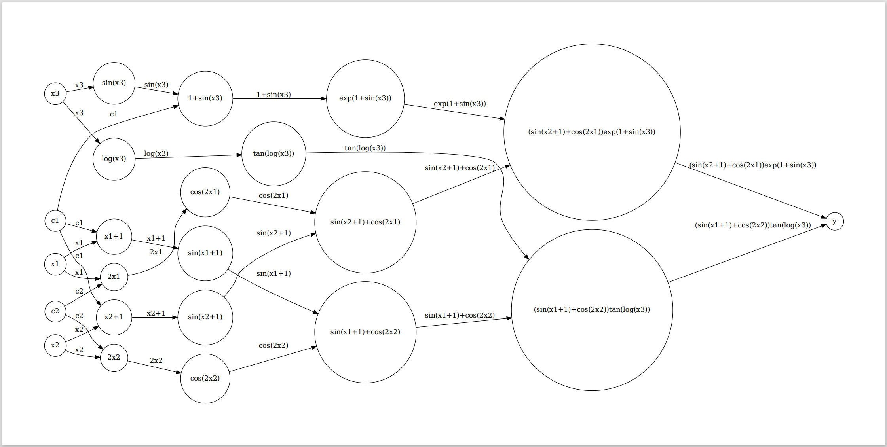
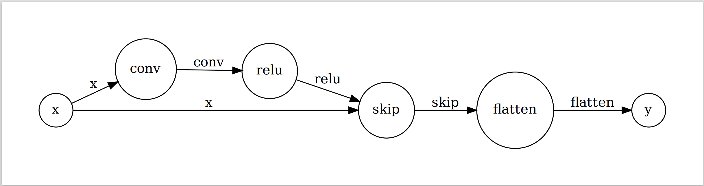

### Computation Graph for Automatic Differentiation

This repo holds the code for an automatic differentiation program that works on a given expression DAG or a computation graph. Main classes are **Node** and **Graph**. The class **Operator** is a special class inherited from **Node** and take nodes  as inputs and produces output. The forward computation produces the value of expression or network. And the backward computation propagate the gradients.

#### Supported Operator

**Scalar**

add, minus, multiply, divide, sin, cos, tan, exp, log -- implemented in "op.py".

**Tensor**

TensorAdd, Conv2D, Relu, Flatten, FullyConn -- implemented in "tensorop.py".

#### Usage

Our program reads computation graph from json config files. (Examples in "func1.json" and "func2.json"). In the json file, nodes are initialized with "name" and "inputs"/"value"/"weight". The order of nodes in the computation graph are required to be given in topo-logical order (i.e. a node cannot take another node defined after it as input).

#### Examples

We give to graph examples and test the forward computation and gradient computation on them.

**Scalar**

$y = (sin(x_1+1)+cos(2x_2))tan(log(x_3))+(sin(x_2+1)+cos(2x_1))exp(1+sin(x_3))$

**Tensor**

$y = FullyConnected(Flatten(Relu(Conv(x)) + x))$ -- one ResNet block


Execution result:

```
Loading file func2.json, function: y = (sin(x1+1)+cos(2x2))tan(log(x3))+(sin(x2+1)+cos(2x1))exp(1+sin(x3))
<\Nabla f(x), v>        : 31.16040515263436
[f(x+tv) - f(x)] / t    : 31.155647660643382

Loading file func1.json, function: y = FullyConnected(Flatten(Relu(Conv(x)) + x))
<\Nabla f(x), v>        : 25.894727606715435
[f(x+tv) - f(x)] / t    : 25.894727606754486
```

Visualized graph:



